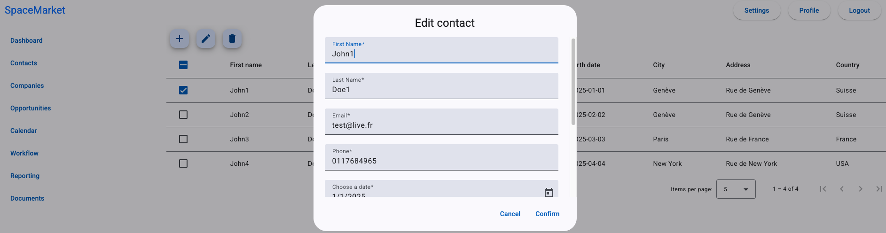

SpaceMarket is a CRM project using Angular 20, Java 24 Spring 3.5.3 and PostGresSQL

 - Installation : 
        1. Go in the root project (SpaeMarket)
        2. Open a terminal then run the back and front with this command :  
                node start.js
           
           The back will start in test environment 

