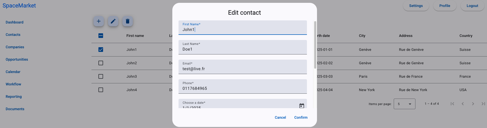

# SpaceMarket

SpaceMarket is a CRM project using **Angular 20**, **Java 24 Spring 3.5.3**, and **PostgreSQL**.

## Installation

1. Go to the root project folder (`SpaceMarket`).

2. To run both the backend and frontend ; 

    a. Open a terminal 
    
    b. Run this command: **node start.js**

